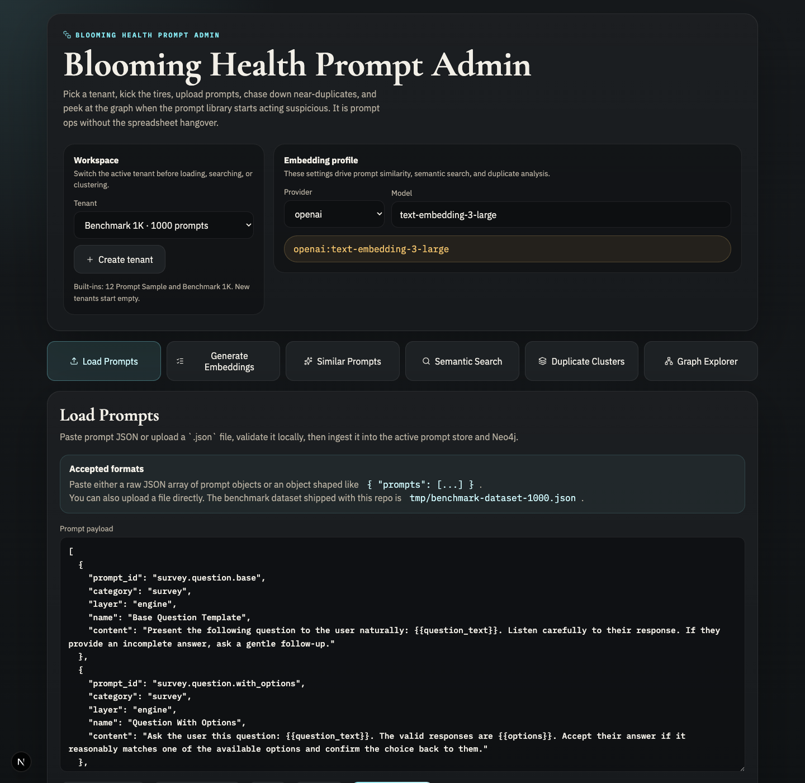
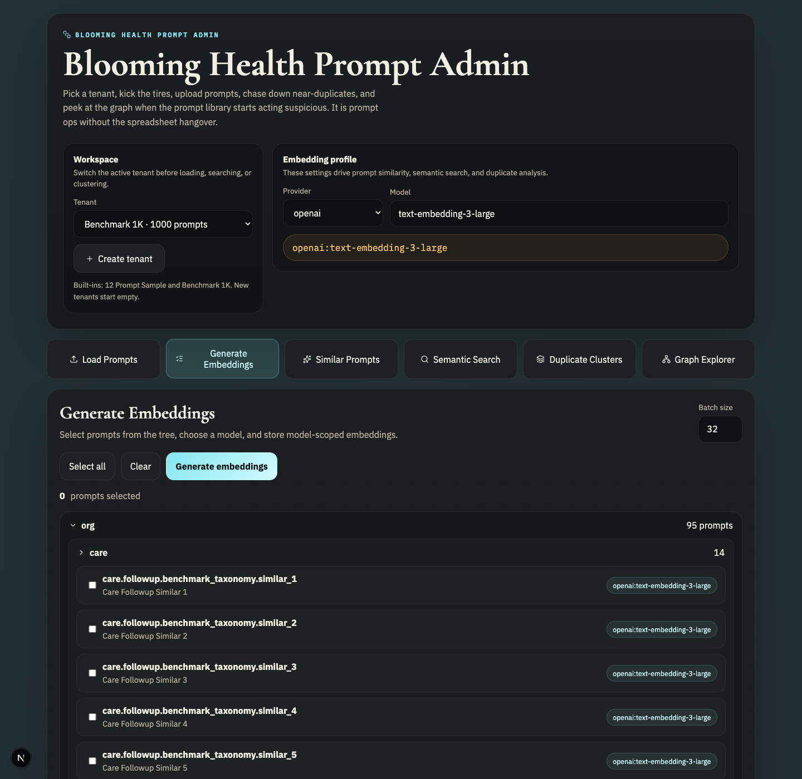
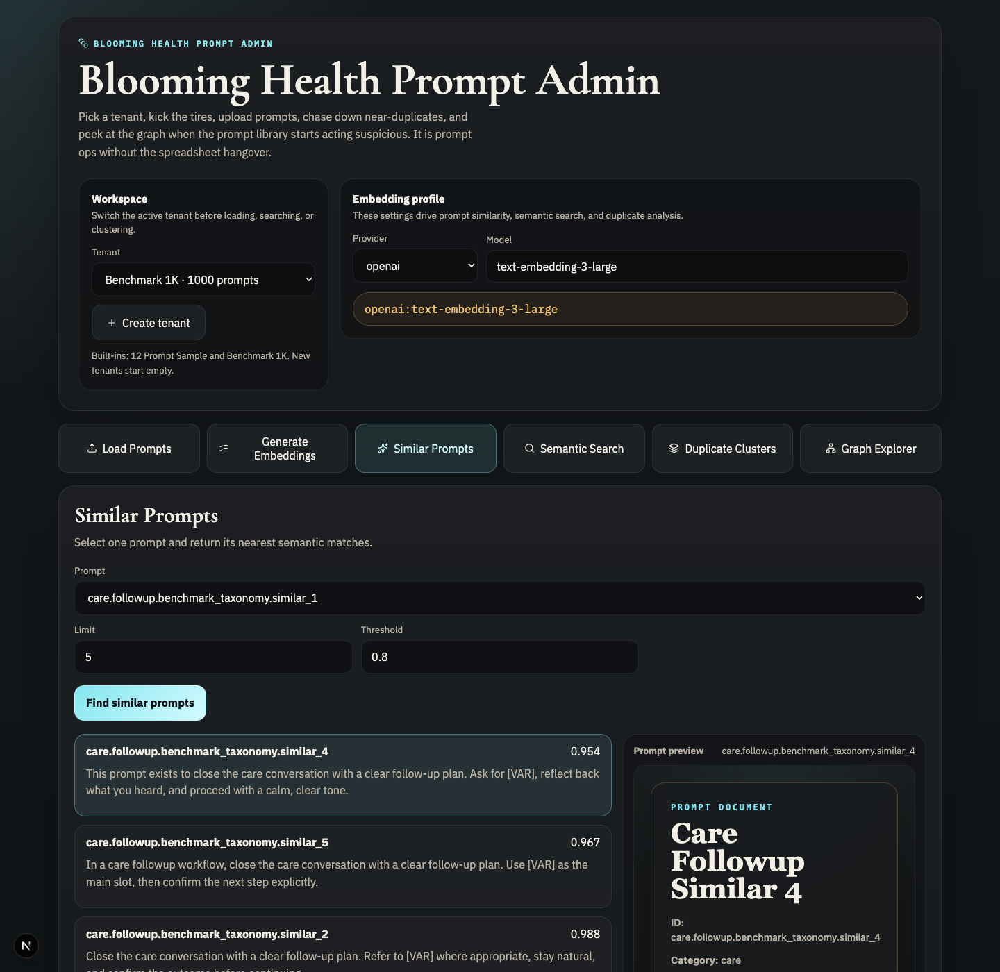
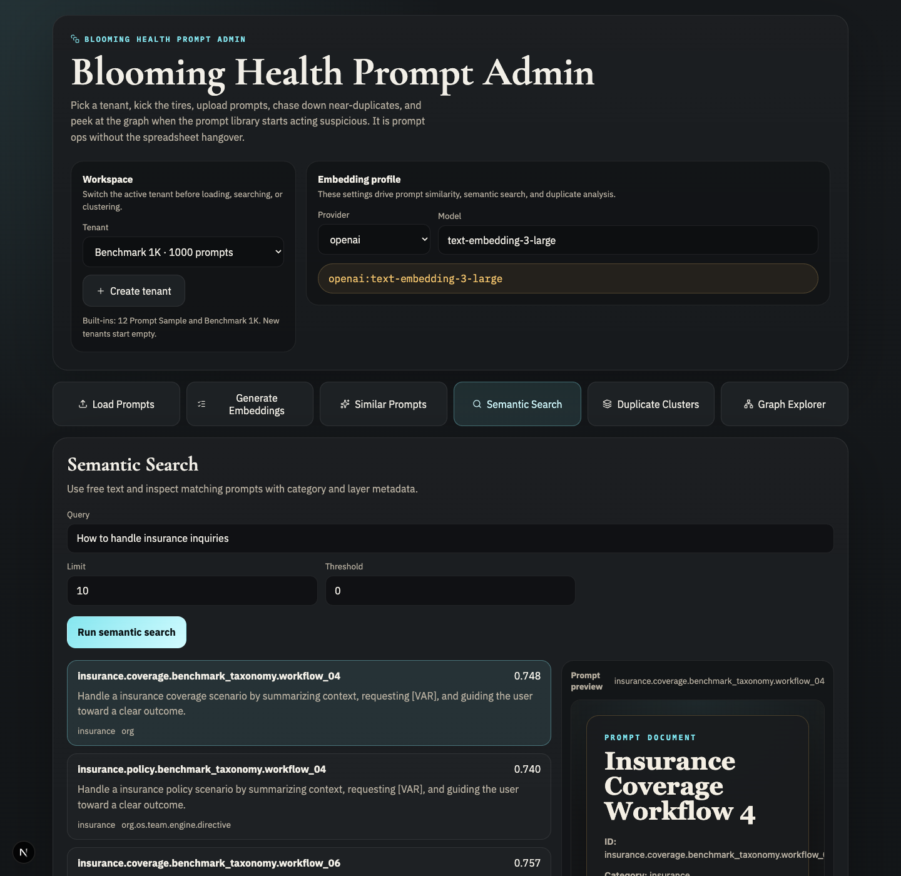
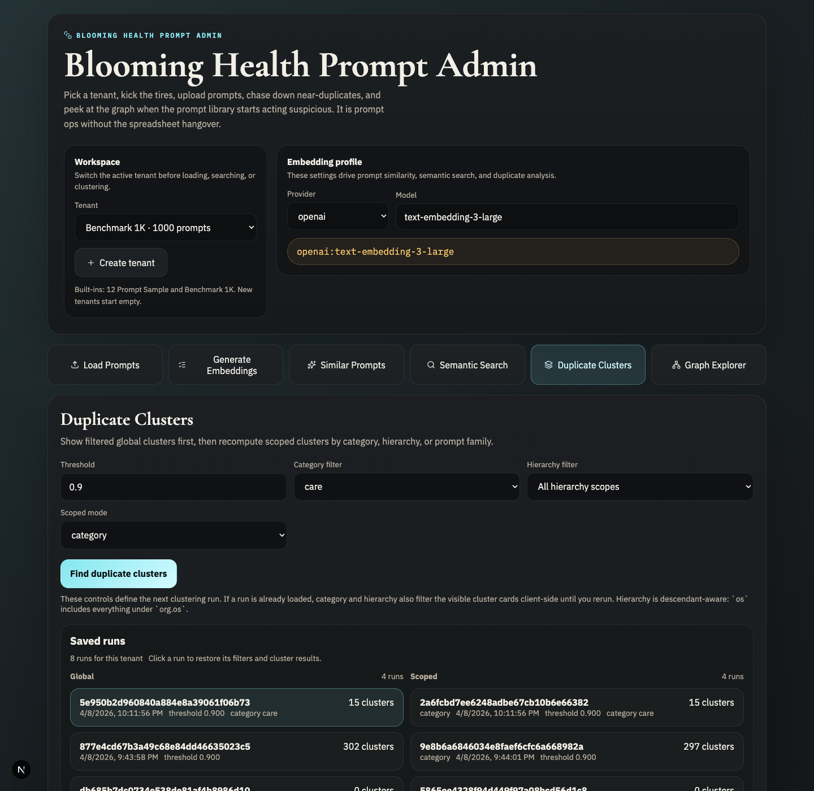
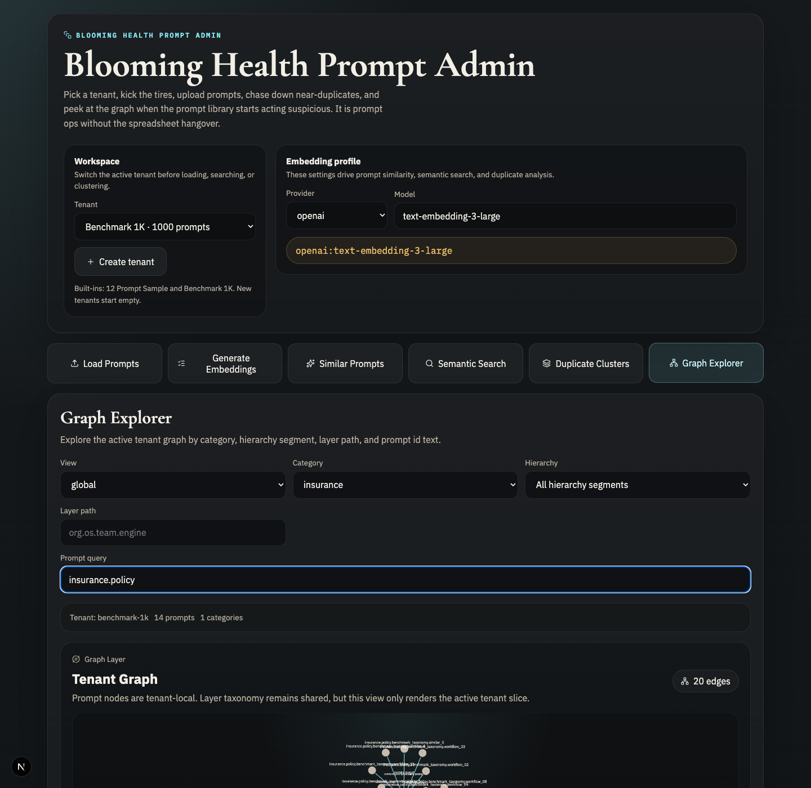
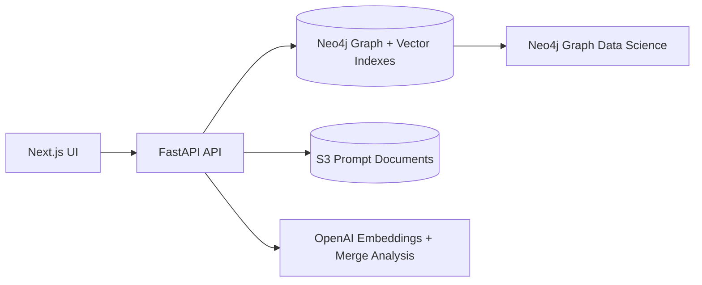
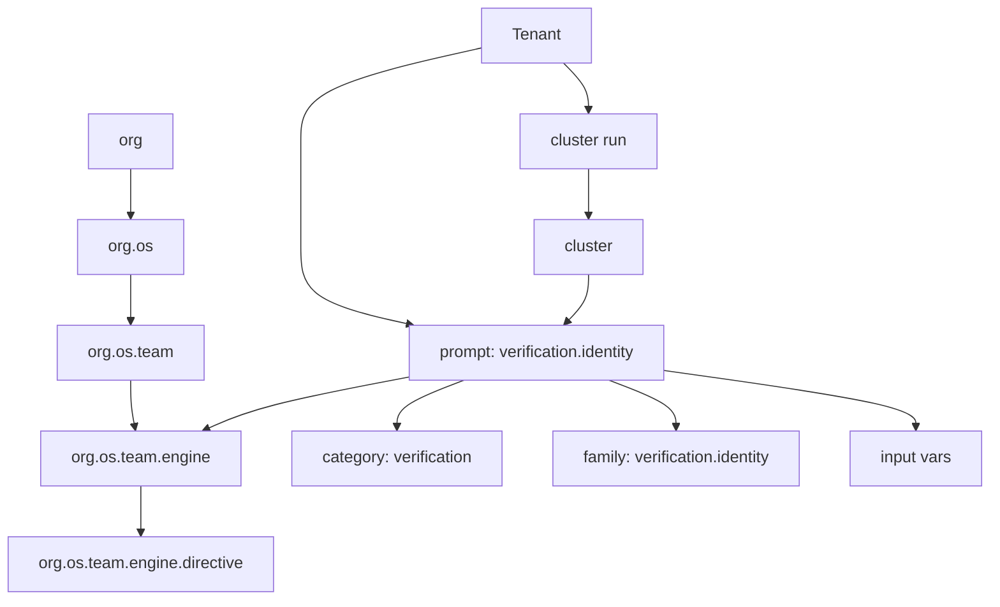
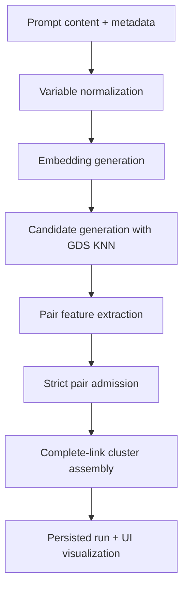
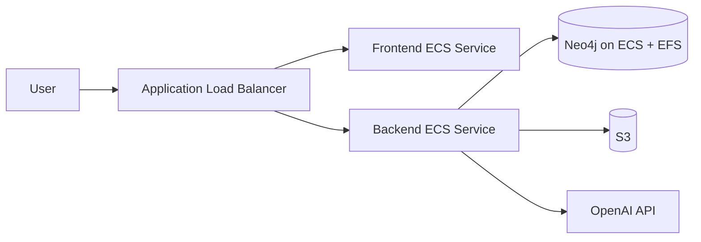

# Prompt Similarity & Deduplication Service

Tenant-aware prompt intelligence for a layered voice AI prompt library.

Live deployment:
- UI + API: [Blooming Health Prompt Admin](http://Prompt-LoadB-yGISyWC2qKyo-1525484510.us-east-1.elb.amazonaws.com)

This project was built against the prompt-service case study:
- generate embeddings for prompt templates
- find similar prompts by prompt id
- run semantic search over prompt meaning instead of title text
- identify likely duplicates and help consolidate the library

It also adds the bonus features that make the system feel like a real operator tool:
- tenant isolation
- graph visualization
- persisted clustering runs
- scoped duplicate analysis by category, hierarchy, and prompt family
- a 1k-prompt benchmark with measurable retrieval and clustering metrics

## Stack

- Backend: FastAPI
- Frontend: Next.js
- Graph store: Neo4j
- Graph Data Science: Neo4j GDS
- Prompt document store: S3
- Embeddings: OpenAI
- Infra: AWS ECS Fargate + ALB + Secrets Manager + EFS-backed Neo4j

## Quick Start

You can test the app in two ways:
- use the live cloud deployment
- run it locally against your own Neo4j GDS sandbox

### Fastest Way To Try It

Open the deployed app:
- [Blooming Health Prompt Admin](http://Prompt-LoadB-yGISyWC2qKyo-1525484510.us-east-1.elb.amazonaws.com)

Then:
1. In the `Workspace` card, select `Benchmark 1K · 1000 prompts`
2. Use the tabs to inspect preloaded prompts, search behavior, duplicate clustering, and the graph
3. If you want to test ingestion yourself, click `Create tenant`, then load your own prompts into that empty tenant

Built-in tenants:
- `12 Prompt Sample`
  - small and fast for quick smoke tests
- `Benchmark 1K`
  - the full benchmark tenant for realistic duplicate-analysis and graph exploration

### Local Quick Start

If you want to run the app locally:

```bash
cp .env.example .env
./scripts/start-local.sh
```

Then open:
- Frontend: `http://127.0.0.1:3000`
- Backend: `http://127.0.0.1:8001`

The local UI behaves the same way:
1. choose a built-in tenant to inspect preloaded data
2. or create a new tenant
3. then paste prompt JSON or upload a `.json` file

The repo already includes a ready-to-use benchmark file:
- [`tmp/benchmark-dataset-1000.json`](tmp/benchmark-dataset-1000.json)

## Product Tour

If you just want to see the whole system working without loading your own data:
1. open the [deployed app](http://Prompt-LoadB-yGISyWC2qKyo-1525484510.us-east-1.elb.amazonaws.com)
2. in the `Workspace` card, select `Benchmark 1K · 1000 prompts`
3. click through the tabs in order:
   `Generate Embeddings` -> `Similar Prompts` -> `Semantic Search` -> `Duplicate Clusters` -> `Graph Explorer`

If you want to test your own prompt set:
1. click `Create tenant`
2. switch into that new tenant
3. use `Load Prompts` to paste JSON or upload a `.json` file
4. generate embeddings
5. run search and duplicate analysis inside that tenant

### Screenshots

Workspace and built-in tenant selection:



Embedding generation from the prompt tree:



Prompt-to-prompt similarity lookup:



Free-text semantic search with prompt preview:



Saved duplicate-analysis runs with filters:



Tenant graph exploration across hierarchy, category, and family structure:



## What The Service Covers

Required endpoints from the case study:
- `POST /api/embeddings/generate`
- `GET /api/prompts/{prompt_id}/similar`
- `POST /api/search/semantic`
- `GET /api/analysis/duplicates`

Additional operator endpoints:
- `POST /api/prompts/load`
- `GET /api/prompts`
- `GET /api/prompts/{prompt_id}/preview`
- `POST /api/analysis/clusters/run`
- `GET /api/analysis/runs`
- `GET /api/analysis/runs/{run_id}`
- `GET /api/analysis/runs/{run_id}/clusters/{cluster_id}`
- `GET /api/analysis/runs/{run_id}/visualization`
- `POST /api/analysis/merge-suggestions`
- `GET /api/graph/explorer`
- `GET /api/tenants`
- `POST /api/tenants`

## Local Setup

### 1. Prerequisites

You need:
- Python 3.13+
- Node 20+
- npm
- an OpenAI API key
- a Neo4j Sandbox **Graph Data Science** instance

Create the Neo4j sandbox here:
- `https://sandbox.neo4j.com/`

Use a **Graph Data Science** sandbox, not a plain AuraDB database, if you want the intended local path and the fast candidate-generation path. The code has a fallback when GDS procedures are unavailable, but the benchmarked setup assumes GDS is present.

### 2. Configure `.env`

Copy the example file:

```bash
cp .env.example .env
```

Files:
- [`.env.example`](.env.example)
- [`scripts/start-local.sh`](scripts/start-local.sh)

Fill in at least:

```dotenv
OPENAI_API_KEY=...
NEO4J_URI=neo4j+s://<your-gds-sandbox-host>
NEO4J_USERNAME=neo4j
NEO4J_PASSWORD=...
NEO4J_DATABASE=neo4j
PROMPT_S3_BUCKET=
PROMPT_S3_PREFIX=prompts
PROMPT_STORE_ROOT=tmp/prompt_store
AWS_REGION=us-east-1
EMBEDDING_PROVIDER=openai
EMBEDDING_MODEL=text-embedding-3-large
MERGE_ANALYSIS_MODEL=openai:gpt-4o-mini
FRONTEND_ORIGINS=http://localhost:3000,http://127.0.0.1:3000
```

Local default:
- prompt documents are stored on disk under `PROMPT_STORE_ROOT`
- no AWS credentials are required just to run the app locally

Optional local S3 mode:
- set `PROMPT_S3_BUCKET`
- configure AWS credentials

### 3. Install Dependencies

Backend:

```bash
python3 -m venv .venv
source .venv/bin/activate
pip install -r requirements.txt
```

Frontend:

```bash
cd web
npm ci
cd ..
```

### 4. Start Everything

Use the local bootstrap script:

```bash
./scripts/start-local.sh
```

That script:
- validates `.env`
- checks AWS credentials only if `PROMPT_S3_BUCKET` is set
- starts the FastAPI backend on `127.0.0.1:8001`
- starts the Next.js frontend on `127.0.0.1:3000`

URLs:
- Frontend: `http://127.0.0.1:3000`
- Backend: `http://127.0.0.1:8001`

Manual commands if you want them separately:

```bash
source .venv/bin/activate
python3 -m uvicorn app.main:app --reload --host 127.0.0.1 --port 8001
```

```bash
cd web
NEXT_PUBLIC_API_BASE_URL=http://127.0.0.1:8001 npm run dev -- --hostname 127.0.0.1 --port 3000
```

## System Design

### Why A Graph

The core problem is not just “store prompts.” It is “store prompts that can be grouped and analyzed in multiple overlapping ways at the same time.”

Each prompt participates in several structures simultaneously:
- a shared layer hierarchy
- a tenant-local category
- a tenant-local prompt family
- an input-variable set
- one or more saved duplicate-analysis runs

That is why Neo4j is a better fit than a single flat table. We are not just querying prompt rows. We are traversing relationships across:
- inheritance-like hierarchy
- business domains
- subcategory-like families
- cluster membership
- run history

The graph lets us ask multiple valid questions over the same prompt library:
- “show me duplicates globally”
- “show me duplicates only within education”
- “show me duplicates within prompts under `org.os.team.engine`”
- “show me how this prompt sits relative to its category and family”
- “show me the graph slice for the active tenant”

### Architecture Overview



### Shared vs Tenant-Local Data

The service is multi-tenant by design.

Shared across tenants:
- layer hierarchy
  - `org`
  - `org.os`
  - `org.os.team`
  - `org.os.team.engine`
  - `org.os.team.engine.directive`

Tenant-local:
- prompts
- categories
- prompt families
- input variables
- cluster runs
- clusters
- prompt documents in S3

That means `verification.identity` can exist in more than one tenant without collision.

### Graph Structure



### Prompt Structure

Each prompt is modeled along four parallel dimensions:

- `category`
  - business domain like `verification`, `survey`, `support`
- `prompt family`
  - subcategory-like lineage derived from the prompt id, like `verification.identity` or `survey.question`
- `layer path`
  - placement in the shared hierarchy, like `org.os.team.engine`
- `input variables`
  - extracted placeholders like `{{date_of_birth}}`

This is the reason the graph explorer is useful. The same prompt can be inspected from multiple angles without flattening away important context.

## How The App Works

### Tenants

The UI has one active tenant at a time.

Built-ins:
- `12 Prompt Sample`
- `Benchmark 1K`

You can also create new empty tenants. Once selected, the tenant becomes app state and every prompt-scoped request is sent with `X-Tenant-Id`.

### UI Walkthrough

The UI is organized around six main tabs.

#### Load Prompts

Use this when you want to ingest data into the active tenant.

You can:
- paste a JSON array of prompts
- upload a `.json` file from disk
- validate the payload before writing anything
- ingest validated prompts into Neo4j and the configured prompt-document store

Good ways to test it:
- select `12 Prompt Sample` or `Benchmark 1K` if you just want to explore existing data
- create a new tenant if you want a clean workspace
- upload [`tmp/benchmark-dataset-1000.json`](tmp/benchmark-dataset-1000.json) if you want to test large-tenant ingest yourself

#### Generate Embeddings

Use this after loading prompts into a tenant.

This tab:
- generates embeddings for all prompts in the active tenant or a selected subset
- stores the vectors back onto prompt nodes in Neo4j
- prepares the tenant for semantic search, similar-prompt lookup, and duplicate clustering

#### Similar Prompts

Use this to start from one known prompt id and inspect its nearest semantic neighbors.

This is the quickest way to answer:
- “what other prompts look like `verification.identity`?”
- “did we accidentally create a near-duplicate under another family or category?”

#### Semantic Search

Use this when you know the meaning you want but not the prompt id.

This tab:
- accepts free text like `how to handle user interruptions`
- searches semantically over the active tenant
- supports a similarity threshold so you can tighten or broaden the result set

#### Duplicate Clusters

Use this to find potential consolidation opportunities.

This tab supports:
- global clustering across the selected tenant slice
- scoped clustering by category
- scoped clustering by hierarchy
- scoped clustering by prompt family
- saved runs that can be reopened later
- post-run filtering by category and hierarchy so you can narrow an existing run without recomputing it

This is the best tab for understanding how the system behaves under different scopes and filters.

#### Graph Explorer

Use this to inspect how the active tenant is organized in the graph.

The explorer lets you view:
- the full tenant slice
- category rollups
- hierarchy-based slices
- prompt-family structure

It is useful for seeing:
- how prompts sit under the shared layer hierarchy
- how prompts roll into tenant-local categories
- how prompt families behave like subcategory groupings
- why a prompt might appear in a specific duplicate-analysis slice

### Prompt Loading

Load prompt JSON into the active tenant. The backend:
- validates the payload
- stores prompt documents in S3
- writes prompt nodes and relationships into Neo4j
- extracts prompt-family and variable metadata

Local note:
- if `PROMPT_S3_BUCKET` is unset, prompt documents are stored on local disk under `PROMPT_STORE_ROOT`
- if `PROMPT_S3_BUCKET` is set, the same flow writes prompt documents to S3

### Embeddings

Embeddings are generated in the backend application and stored back onto prompt nodes in Neo4j.

We intentionally moved embedding generation out of Neo4j server-side procedures so the runtime is portable and does not depend on Neo4j-specific model integrations.

### Similar Prompts

The UI can take a prompt id and return nearest matches. This is the required “find similar prompts given a prompt id” case-study flow.

### Semantic Search

The UI also supports free-text semantic search with a threshold. That gives operators control over how broad or strict the search should be.

### Duplicate Clusters

Duplicate analysis supports:
- global clustering
- scoped clustering by category
- scoped clustering by hierarchy segment
- scoped clustering by prompt family

You can also:
- save a run
- reopen a run later
- click a run and restore its saved clustering state
- apply category and hierarchy filters to the visible cluster results in the UI

### Graph Explorer

The graph explorer is tenant-scoped and supports multiple views:
- global
- category
- hierarchy
- prompt family

You can use it to see:
- how prompts connect to the shared hierarchy
- how they roll up into categories and families
- how a tenant’s prompt slice is structured

This is useful for debugging prompt organization, not just duplicate detection.

## Similarity Pipeline

### Variable Normalization

Before embedding, template placeholders are normalized so variable names do not dominate the vector space.

Examples:
- `{{question_text}}` -> `[VAR]`
- `{{date_of_birth}}` -> `[VAR]`

That helps the embedding represent instruction flow and semantic intent instead of memorizing placeholder names.

### Hybrid Retrieval

Search is hybrid, not purely vector:

1. vector retrieval from Neo4j vector indexes
2. full-text retrieval from Neo4j full-text indexes
3. rank fusion in Python

Supported rankers:
- `rrf`
- `naive`
- `linear`

This matters because prompt search is partly semantic and partly structural. Prompt ids, workflow names, and family labels still matter.

## Duplicate Clustering Design

### The Naive Approach

The naive duplicate algorithm was:

1. compute prompt-to-prompt similarity
2. keep edges above a threshold
3. run connected components

That looks reasonable until you try it on a large prompt library.

Why it failed:
- prompt libraries share lots of boilerplate
- workflow variants are often only a sentence apart
- connected components over-merge through chains
  - if `A ~ B` and `B ~ C`, then `A`, `B`, and `C` collapse into one cluster even when `A` and `C` should not merge

The result was one of the exact failure modes we wanted to avoid:
- giant plausible-looking clusters
- high recall
- bad precision
- poor merge safety

### The Improved Approach

We split the problem into two stages:

1. candidate generation
2. strict duplicate admission and cluster assembly

### Candidate Generation

When GDS is available, we use:
- `gds.graph.project`
- `gds.knn.filtered.stream`

That gives a bounded nearest-neighbor candidate set over the allowed prompt slice instead of comparing every prompt to every other prompt.

If GDS is unavailable, the repository falls back to an application-side similarity sweep. That is slower, but it keeps the system functional.

### Pair Features

For every candidate pair we compute features like:
- forward similarity
- reverse similarity
- reciprocal presence
- shared category
- shared prompt family
- shared layer lineage
- shared variable count
- normalized content similarity
- token overlap

### Strict Admission

Pairs are only admitted if they pass a stricter gate than normal search:
- must clear the base threshold
- must be reciprocal
- must clear an average-score floor
- prompt-family pairs must also clear content similarity and token overlap floors
- cross-scope pairs require an even stricter floor

### Cluster Assembly

The clusterer then uses a complete-link style rule:
- a prompt can join a cluster only if it has an admitted edge to **every** existing member
- two clusters can merge only if **every cross-pair** is admitted

That is the key change that prevents the naive “bridge prompt creates one giant blob” failure mode.

### Duplicate Pipeline Diagram



## Clustering Scopes And Filters

There are two separate ideas in the UI:

- **scope**
  - global
  - category
  - hierarchy
  - prompt family
- **filters**
  - category filter
  - hierarchy filter

How to think about them:

- scope answers: “where do we cluster?”
- filters answer: “which prompts are even allowed into this run?”

Examples:
- global + no filters
  - cluster the whole tenant
- global + category `education`
  - cluster only education prompts, but still as one global pool
- scope `hierarchy` + filter `engine`
  - group prompts inside hierarchy buckets under `engine`
- scope `prompt_family`
  - cluster independently inside each prompt family

Once a run exists, the same category and hierarchy controls can also narrow the displayed cluster list client-side so you can inspect a saved run without recomputing it.

## Saved Runs

Cluster runs are persisted per tenant.

A run stores:
- `run_id`
- scope mode
- scope key
- threshold
- model/provider
- applied filters
- cluster count
- member prompts
- edge payloads

That gives you a stable analysis artifact you can reopen later instead of rerunning clustering every time.

This matters operationally because large global runs are expensive enough that persisting them is the right product behavior.

## Benchmarks

The repository includes a generated 1k benchmark dataset and a benchmark script:
- dataset: `tmp/benchmark-dataset-1000.json`
- benchmark runner: `scripts/benchmark_prompts.py`

We used the benchmark to tune the duplicate logic instead of guessing.

### Why The Benchmark Helped

Without a benchmark it is easy to optimize for “looks plausible.”

The 1k benchmark made failures measurable:
- similar-search accuracy
- semantic-search quality
- duplicate cluster recall
- duplicate pairwise precision

That let us see that the naive clusterer was finding the expected families but also over-merging lots of unrelated pairs.

### 1k Benchmark Snapshot

Results from `tmp/benchmark-report-1000-accuracy.json`:

| Metric | Result |
| --- | --- |
| Similar search top-1 hit rate | `1.00` |
| Similar search top-3 hit rate | `1.00` |
| Similar search avg latency | `59.01 ms` |
| Semantic search top-3 hit rate | `0.875` |
| Semantic search avg latency | `338.21 ms` |
| Duplicate analysis threshold | `0.9` |
| Duplicate analysis runtime | `102,353.36 ms` |
| Expected duplicate clusters | `50` |
| Actual clusters returned | `309` |
| Subset cluster recall | `0.86` |
| Exact cluster recall | `0.84` |
| Pairwise precision | `0.465` |
| Pairwise recall | `0.944` |
| Pairwise F1 | `0.624` |

Interpretation:
- retrieval is strong
- duplicate clustering is materially better than the naive over-merged version
- duplicate clustering is still the hardest part of the problem and the place where benchmark feedback mattered most

### Production Note

On the deployed AWS stack, the full `benchmark-1k` global duplicate request at `threshold=0.9` currently completes in about `255.93s`.

That proves the path works in production, but it is still too slow for ideal synchronous UX. The next hardening step is to make large cluster-run creation async and poll run status from the UI.

## Deployment

The deployed stack uses:
- ECS Fargate for backend and frontend
- ALB for public routing
- Neo4j running in ECS with EFS-backed persistence
- S3 for prompt documents
- Secrets Manager for runtime secrets

High-level deployment shape:



## API Notes

Core endpoints:

```text
POST /api/embeddings/generate
GET  /api/prompts/{prompt_id}/similar
POST /api/search/semantic
GET  /api/analysis/duplicates
```

Operational endpoints:

```text
POST /api/analysis/clusters/run
GET  /api/analysis/runs
GET  /api/analysis/runs/{run_id}
GET  /api/analysis/runs/{run_id}/clusters/{cluster_id}
GET  /api/analysis/runs/{run_id}/visualization
GET  /api/graph/explorer
GET  /api/tenants
POST /api/tenants
```

Every prompt-scoped request requires:

```text
X-Tenant-Id: <tenant-id>
```

## Summary

This system is not just “prompt search with embeddings.”

It is a tenant-aware prompt intelligence system that:
- models prompt structure as a graph
- supports multiple analysis scopes over the same prompt library
- uses hybrid retrieval for search
- uses GDS-backed candidate generation plus a strict duplicate clusterer
- persists clustering runs so operators can revisit analysis instead of recomputing it
- includes a UI for search, duplicate review, merge analysis, and graph exploration

That is the full reasoning behind the design: the hard part of prompt management is not storing text, it is understanding how prompts relate to each other across hierarchy, category, family, and duplication risk.
